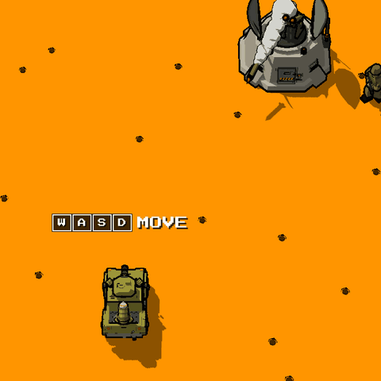

# План: магазин между уровнями

Концепция для 3D-предпросмотра (`src/game3d/level3d_preview.tscn`): игрок
зарабатывает очки, спасая пленных и уничтожая врагов, и между уровнями тратит
их на жизни и апгрейды. 2D-игру (`src/game2d/`) это не трогает. Все части
сделаны (ниже); цены и числа — точка отсчёта для подгонки по игре.

## Статус

Пошаговый план реализации с Definition of Done — `docs/shop-implementation.md`.

| Часть | Что | Статус |
|---|---|---|
| 0 | Круги: после уровня — тот же уровень, сложнее | сделано |
| 1 | Очки как валюта, покупка жизней | сделано |
| 2 | Детали модели джипа: спаренный пулемёт, защита и остальное | сделано |
| 3 | Сцена магазина: джипы по краям, матрица в центре | сделано |
| 4 | Пассивные апгрейды: боезапас (был ЗИП), противоосколочная защита, бойницы (сняты, раздел 3), радар, спаренный пулемёт; апгрейд пусковой | сделано |
| 5 | Клавиша «устройство»: форсаж (был нитро), мины, авиаудар | сделано |

## 0. Решения

- **Очки — это валюта.** Один ресурс, отдельного счёта-рекорда нет: покупка
  уменьшает очки на HUD. На экране это деньги: экипажи — наёмники, им платят
  за врагов и пленных, и тратят они это в магазине. HUD показывает `$038400`
  (шесть цифр, как счёт в игре, — счётчик не меняет ширину, как деньги в
  Chinatown Wars, `Level3DHud.money`), всплывающие суммы — `+$2000`, магазин —
  кошелёк и цены в долларах. Знак `$` добавлен в оба шрифта превью
  (`tools/font3d_bake.py`).
- **Жизнь за очки отменяется.** Сейчас жизнь даётся при 20 000 и затем каждые
  50 000 (`_add_points` в `level3d_preview.gd`, как `PlayerState.add_points`);
  вместо этого жизни покупаются в магазине. Это отклонение от оригинала, его
  надо записать в `docs/preview3d.md`.
- **Уровень пока один**, поэтому после победы запускается тот же уровень, но
  сложнее (круг 2, 3, …). Чем именно сложнее — открытый вопрос (раздел 6).
- **Один апгрейд — одна покупка.** Ступеней у апгрейдов нет. Исключение —
  апгрейд пусковой: это не апгрейд джипа, а ступень ракетницы, и её можно
  покупать, пока ракетница не на последней ступени.
- **За один заход в магазин покупается сколько угодно** — пока хватает очков:
  жизни, апгрейды, ступени пусковой подряд.
- **В кооперативе у каждого игрока свои** очки, жизни и апгрейды. Магазин
  общий: одна матрица товаров, у каждого игрока свой курсор, покупают оба
  одновременно (раздел 4).
- **Всё доступно сразу.** Открытия товаров по кругам нет: доступность
  балансируется ценой — сильное стоит почти целого круга.
- **Машина — бронепикап** (`resources/3d/jackal_armored.glb`, по умолчанию
  в превью, в магазине и в заставке) со своими деталями апгрейдов (раздел 3,
  «Детали на моделях»). Джип (`resources/3d/jackal_jeep.glb`) — флагом
  `--jeep`. БТР пока не трогаем: ни в магазине, ни в деталях апгрейдов.
- **Апгрейды дают новые функции, а не числа.** Никаких «+20% урона»: каждый
  апгрейд закрывает конкретную ситуацию на уровне — смерть с грузом пленных,
  потерю ракет, врагов за кадром, погоню.
- **Бойницы пока сняты.** В коде они сделаны (`_loopholes` в
  `level3d_preview.gd`, деталь `Jeep_UpLoopholes`), но в план апгрейдов не
  входят, а на бронепикапе детали для них нет.
- **Названия.** ЗИП переименован в «Боезапас»: в магазине он даёт запасную
  ракету, и на модели это стойка с ней. Нитро переименовано в «Форсаж»:
  «Турбо» уже занято автоогнём (`ButtonMapping.turbo`). В коде остались
  прежние идентификаторы `zip` и `nitro`.
- **Одна клавиша «устройство»** на игрока. Форсаж, мины и авиаудар — устройства;
  в магазине выбирается, какое из купленных стоит в слоте на следующий круг.
  Три отдельные клавиши не помещаются: во втором игроке на клавиатуре и так
  тесно.

## 1. Поток игры

1. Уровень. Очки идут за врагов и пленных, как сейчас.
2. Босс побеждён → итоговое окно (`Level3DSummary`).
3. Любая клавиша → **магазин**. Покупки, выбор устройства в слот.
4. «В бой» → тот же уровень, круг +1: враги и пленные заново, у игрока
   остаются очки, жизни, апгрейды, ракеты.
5. **Game over** возвращает к состоянию на выходе из последнего магазина
   (очки, жизни, апгрейды), а не к нулю. На первом круге — к старту игры.

## 2. Экономика

Сколько стоит враг: солдат 100, пушка и танк 500, катер и сегмент босса 800;
пленный — 300 (хижина) или 800 (дом) за освобождение и 500 за высадку у
вертолёта.

Грубая оценка полной зачистки `stage-0`: ~80 солдат (8 000), 15 пушек (7 500),
7 танков (3 500), 5 катеров (4 000), босс (~3 200), 13 пленных (~10 000) —
**около 35 000 за круг**. На пленных приходится около трети; если спасение
должно стать главным доходом, поднять цену высадки до 1 000–1 500.

Жизнь: 15 000, каждая следующая на 5 000 дороже. При таких ценах за круг
покупается одна-две вещи — либо жизнь, либо апгрейд, а самое сильное стоит
почти целого круга.

## 3. Апгрейды

| Апгрейд | Вид | Цена |
|---|---|---|
| Радар | пассивный | 8 000 |
| Форсаж | устройство | 10 000 |
| Апгрейд пусковой | ступень ракетницы, повторяемая | 10 000 / 15 000 / 20 000 |
| Боезапас | пассивный | 15 000 |
| Мины | устройство | 15 000 |
| Спаренный пулемёт | пассивный | 20 000 |
| Противоосколочная защита | пассивный | 25 000 |
| Усиленный корпус | одноразовый, покупается снова | 10 000 |
| КАЗ «Арена» | пассивный, с перезарядкой, в магазине пока нет | 20 000 |
| Авиаудар | устройство | 30 000 + цена вызова |
| Жизнь | расходник, повторяемая | 15 000, каждая следующая +5 000 |

Боезапас и противоосколочная защита вместе — сильная страховка от гибели; вместе
они стоят 40 000, больше круга, и это их сдерживает.

### Детали на моделях

Каждый апгрейд с деталью — своя коллекция `<Модель>_Upgrade_*` с корнем
`<Модель>_Up*`, скрыта в файле и в glb; превью показывает купленное
(`UPGRADE_PARTS` в `level3d_btr.gd`). Префикс модели: `Jeep_` у джипа,
`Armored_` у бронепикапа.

| Апгрейд | Джип (`jackal_jeep.py`) | Бронепикап (`jackal_armored.py`) |
|---|---|---|
| Спаренный пулемёт | `UpTwin`: два ствола из общей маски, вместо `Gun` | `UpTwin`, скопирован с джипа, вместо `Gun` |
| Противоосколочная защита | `UpArmor`: борта кузова подняты, щитки снаружи и на дверях | `UpArmor`: смотровые щели в лобовом и дверях вместо стекла (`Glass`) |
| Боезапас | `UpZip`: ящик в переднем левом углу кузова | `UpZip`: стойка у кабины со снарядом ступени ниже текущей — на неё пусковая откатится при гибели; на миномёте и первой ракете — мина миномёта |
| Радар | `UpRadar`: мачта на крыше кабины, вращается тарелка `UpRadarDish` | `UpRadar`: мачта с тарелкой `UpRadarDish` вместо прибора наблюдения башни (`TurretSight`) |
| Форсаж | `UpNitro`: два баллона в кузове, трубка к выхлопу | `UpNitro`: две выхлопные трубы вместо одной (`Exhaust`), в перфорированных кожухах |
| Мины | `UpMines`: стойка с тремя минами над задним бампером | `UpMines`: полка с тремя минами на заднем борту |
| Усиленный корпус | нет | `UpHull`: кенгурятник спереди, трубы вдоль порогов, дуги на задних углах и трубчатая рама по контуру борта: капот, кабина, кузов, крылья, — с поперечными трубами по краям крыши |
| КАЗ «Арена» | нет | `UpArena`: по мортирке с тремя стволами на передних углах крыши кабины вместо фонарей (`RoofLamps`); головки `UpArenaHeadL/R` на поворотных основаниях, чтобы разворачивать их к ракете |
| Авиаудар | детали нет, две антенны у джипа стоковые | `UpAirstrike`: антенна, гнётся при езде (звенья `AerialL0..2`) |

У джипа деталь апгрейда добавляется к машине (кроме спаренного пулемёта).
У бронепикапа апгрейд чаще заменяет стоковую деталь, и та при показе
апгрейда прячется. Стоковые детали лежат в своих коллекциях:
- `Armored_Stock_Gun`: `Gun` и `GunBore`, под спаренным пулемётом;
- `Armored_Stock_Exhaust`: `Exhaust`, под форсажем;
- `Armored_Stock_Sight`: `TurretSight`, под радаром;
- `Armored_Stock_Glass`: `Glass`, под защитой;
- `Armored_Stock_Lamps`: `RoofLamps`, фонари на крыше, под КАЗ.

`show_upgrades()` в скрипте так и делает, а в превью — `set_upgrades` по
списку `stock` у бронепикапа в `VEHICLES` (`level3d_btr.gd`).

Бронепикап — машина превью по умолчанию (джип — флагом `--jeep`):
- `airstrike`, `hull` и `arena` есть в `UPGRADE_PARTS`; у джипа этих деталей
  нет, и они пропускаются;
- на стойке боезапаса лежит снаряд ступени ниже текущей — то, к чему
  пусковая откатится при гибели (`set_weapon_level`, его зовут пусковая и
  магазин): на миномёте и первой ракете — мина, дальше — ракета предыдущей
  ступени. Мины на стойке в модели нет: `Level3DBtr._rack_mine` при загрузке
  копирует части мины миномёта и кладёт их поперёк стойки (`UpZipRound0`);
- выхлоп идёт из той трубы, что видна: штатной (`ExhaustTip`) или двух
  труб форсажа (`UpNitroTipL/R`);
- антенна — только с купленным авиаударом, и при гибели срывается только
  тогда;
- мины на полке показывают, сколько их ещё не выложено (`set_mines`);
- во время рывка форсажа из видимых труб бьёт пламя (`_nitro_flames`);
- при гибели с машины срываются и купленные детали, что держатся слабо
  (`Level3DWreck`): обе головки КАЗ, снаряд со стойки боезапаса и одна мина
  с полки.

КАЗ работает (`--upgrades arena`), но в магазине его не купить: на
основном уровне нет ракет, которые он сбивает. Усиленный корпус продаётся
(плитка RAM CAGE).

### Апгрейд пусковой

Ступень ракетницы, как от спецпленного (`Carrier.upgrade_weapon` в
`level3d_friends.gd`): граната → ракета → ракета+ → ракета++. Покупается в
магазине и действует с начала следующего круга — не нужно искать спецпленного,
чтобы войти в уровень с ракетой.

- Можно покупать, пока ракетница не на ракете++, и несколько ступеней за
  один заход, если хватает очков; на ракете++ плитка погашена.
- Ступени, набранные на уровне, и так переходят на следующий круг (раздел 1,
  шаг 4); покупка добавляет одну к тому, что есть.
- Гибель сбрасывает купленную ступень так же, как найденную; с боезапасом — на одну.
  Покупка в магазине — не страховка, а старт с оружием.
- Цена растёт со ступенью: ракета 10 000, ракета+ 15 000, ракета++ 20 000.
  Цена — за ту ступень, на которую ракетница поднимется.

### Спаренный пулемёт

Второй ствол рядом с первым; стволы стреляют поочерёдно. Дальность и темп
каждого ствола те же, общий темп — вдвое выше.

- В пушке уже есть множитель темпа для чита (`rate` в `level3d_gun.gd`,
  `Level3DSettings.gun_rate`): он чаще стреляет и во столько же раз поднимает
  предел пуль в полёте (`Player.MAX_BULLETS`, 3) — без этого турбо упёрлось бы
  в старый темп. Спаренный пулемёт — это `rate` 2 плюс чередование точки
  вылета между стволами.
- Модель: второй ствол на башне джипа рядом с `Jeep_Gun`, вспышка на том,
  который выстрелил.
- С читом темпа множители перемножаются.

### Боезапас (был ЗИП)

При гибели ракетница откатывается на одну ступень, а не сбрасывается целиком:
ракета++ → ракета+ → ракета → граната. С гранатой терять нечего, апгрейд не
действует — так и написать в магазине.

Сейчас гибель сбрасывает всё: `player_died` в `level3d_friends.gd` обнуляет
`has_missiles` и `missile_power`.

### Противоосколочная защита

При гибели все пленные на борту выпрыгивают живыми.

Сейчас (`player_died`, как `Player.explode` оригинала) выживают все, кроме
одного, но не больше четырёх; выжившие разбегаются и их надо подбирать заново.
С ракетами есть шанс 1 из 5, что среди них окажется ещё один, несущий оружие.

| На борту | Выживают сейчас | С защитой |
|---|---|---|
| 1 | 0 | 1 |
| 2 | 1 | 2 |
| 5 | 4 | 5 |
| 6+ | 4 | все |

Пленные по-прежнему выпрыгивают и разбегаются — апгрейд убирает потери, но не
поездку за ними.

### Бойницы (сняты)

Пока не в плане апгрейдов (раздел 0). Задумка была такая: каждый пленный на
борту стреляет в ближайшего врага с темпом и дальностью пехотинца. В коде
это сделано и включается `--upgrades loopholes`, но плитки в магазине нет:
её клетку занял радар.

### Усиленный корпус

Одноразовая рама безопасности: переживает один таран и теряется. Без неё
наезд убивает джип в трёх случаях: на пушку или коричневый танк (гибнут оба)
и на танк босса (гибнет только джип) — `guns.bump`, `tanks.bump` и
`boss.bump` в цикле игрока, `level3d_preview.gd`. С рамой
(`_rammed`, `_shed_cage`):

- пушка и коричневый танк гибнут, как без неё, и очки за них начисляются,
  как всегда за таран;
- танк босса получает целый раунд урона, как от ракеты (`boss.ram`);
- джип цел; кто в кого въехал, не важно;
- рама слетает: апгрейд потерян, её копия отлетает с машины, кувыркаясь, и
  уходит в землю; корпус дёргается, камера трясётся;
- секунду после тарана джип неуязвим и мигает, как после возрождения, —
  чтобы успеть отъехать от танка босса или соседней пушки;
- в следующем магазине раму можно купить снова; держать — только одну.

Пехоту давят бесплатно, как и раньше: солдаты под колёсами не таран. Пули
рама не держит: это не жизнь, а защита от одного способа гибели. Дешевле
жизни (10 000 против 15 000), потому что одноразовая, но при ней не теряются
ни пленные, ни ступень пусковой.

У джипа детали рамы нет: механика работает, но слетать нечему.

### КАЗ «Арена» (в магазине пока нет)

Комплекс активной защиты: сбивает вражескую ракету, летящую в джип, и
перезаряжается. Против пуль, снарядов танков и мин не работает. Сделан
(`_arena` в `level3d_preview.gd`), включается `--upgrades arena`.



- **Когда срабатывает:** ракета подлетела ближе `ARENA_REACH`, 130 px
  (~1,9 м), — трети классической дальности пулемёта (378 px). Остальные
  две трети игрок может сбить ракету сам; КАЗ — последний рубеж, в
  последние ~0,3 с перед попаданием.
- **Одна ракета за срабатывание**, перезарядка `ARENA_RELOAD`, 1000 тиков
  (10 с). Бункер пускает ракету примерно раз в 4 с: одну КАЗ возьмёт,
  следующую придётся сбить или объехать.
- **Как видно:** у бронепикапа ближняя к ракете голова доворачивается на
  неё (`Level3DBtr.arena_fire`), вспышка и трассер, ракета взрывается в
  воздухе, как от пули: этот взрыв джипа не трогает, солдат и другие
  ракеты рядом задевает. У машины без голов залп идёт с крыши.
- **HUD:** надпись ARENA рядом с устройством, серая, пока КАЗ
  перезаряжается.
- На `stage-0` вражеских ракет нет: все его враги стреляют `EnemyBullet`
  (`level3d_guns.gd`). Ракеты есть в оригинале на дальних уровнях:
  `SwampMissile` и пусковые на болоте и скалах, `StatueMissile` и
  `StatueSeekerMissile` у статуй, `SubmarineMissile` у подлодки,
  `ElephantMissile`. В оригинале они убивают как мины, через `bump`, а не
  через `attack`.
- Первый такой враг в превью — ракетный бункер (`CLIFF_MISSILE_LAUNCHER`,
  `level3d_missile_bunkers.gd`, модель `jackal_missile_bunker.glb`): на
  тестовой карте `polygon.json`, впереди старта. Запуск:
  `--file res://assets/level3d/polygon.json --upgrades arena`.
  Его ракета — `SwampMissile`: самонаводящаяся, сбивается одной пулей,
  убивает джип при касании. В магазин КАЗ придёт, когда такой враг
  появится на основном уровне.

### Радар

Метки пушек и танков противника за кадром, на краю экрана, тем же видом, что
стрелки к пленным. Танк — пока жив, пушка — пока цела.

### Форсаж (устройство, был нитро)

Рывок вперёд, чтобы проскочить сектор огня. Перезарядка.

### Мины (устройство)

Сбросить мину позади — против танков, идущих следом. Перезарядка 3 с, не
больше трёх мин игрока сразу.

### Авиаудар (устройство)

Уничтожает врагов на экране. Правила, чтобы не сломать экономику:

1. **Убитые авиаударом не дают очков**, иначе удар окупается и становится
   фермой.
2. **Цена вызова растёт внутри круга:** 2 000 → 4 000 → 8 000; новый круг её
   сбрасывает. Экран обычно стоит 1–2 тысячи очков врагов — вызов ощутим, но
   не разоряет. Не хватает очков — кнопка не срабатывает.
3. **На боссе недоступен**: пока босс на экране, кнопка погашена, чтобы не
   тратить очки на удар, который его не берёт.
4. **Пленных, хижины и дома не трогает** — освобождать пленных остаётся делом
   игрока.

## 4. Магазин и HUD

Отдельная 3D-сцена в Godot. Джипы игроков стоят по краям экрана, в центре —
матрица товаров. Оба игрока выбирают и покупают одновременно.

```
┌──────────────────────────────────────────────────────────────────────────┐
│ 1P  38 400                    СНАБЖЕНИЕ                       2P  21 300 │
│  ┌────────┐   ┌──────────────┬──────────────┬──────────────┐  ┌────────┐ │
│  │        │   │✓ СПАРЕННЫЙ   │  ПУСКОВАЯ    │✓ РАДАР      ✓│  │        │ │
│  │ ДЖИП   │ О │  ПУЛЕМЁТ     │  ракета+     │              │  │ ДЖИП   │ │
│  │  1P    │ Р │      20 000  │ 15 000│10 000│       8 000  │  │  2P    │ │
│  │        │   ├──────────────┼──────────────┼──────────────┤  │        │ │
│  │поворот-│ З │✓ БОЕЗАПАС    │  ЗАЩИТА      │  РАМА        │  │поворот-│ │
│  │ный стол│ А │      15 000  │      25 000  │      10 000  │  │ный стол│ │
│  │        │   ├──────────────┼──────────────┼──────────────┤  │        │ │
│  └────────┘ У │✓ ФОРСАЖ      │  МИНЫ        │  АВИАУДАР    │  └────────┘ │
│  ▮▮▮        С │      10 000  │      15 000  │      30 000  │   ▮▮        │
│  слот: ФОРСАЖ ├──────────────┴──────────────┴──────────────┤  слот: —    │
│               │  ЖИЗНЬ        1P 20 000 │ 2P 15 000        │             │
│  описание     └────────────────────────────────────────────┘  описание   │
│  [ ГОТОВ ✓ ]                                                  [ ГОТОВ ]  │
└──────────────────────────────────────────────────────────────────────────┘
```

- **Матрица** 3×3: строки — оружие и радар, защита, устройства; под ней
  полоса
  «Жизнь» на всю ширину — это расходник, его берут несколько раз.
- **Плитка**: название, цена, метки игроков по углам — ✓ первого слева
  сверху, второго справа сверху, как стоят джипы. У пусковой и жизни цена у
  каждого своя (зависит от купленного) — две цены, каждая со стороны игрока.
  Не хватает очков — цена этого игрока красная.
- **Курсор игрока** — рамка его цвета (оливковая 1P, синяя 2P), ходит по
  четырём направлениям; оба на одной плитке — рамка второго внутри рамки
  первого.
- **Купленное видно дважды**: метка на плитке (жизни — на плитке LIFE,
  ступень пусковой — на LAUNCHER) и на самом джипе (спаренный пулемёт,
  защита, ступень пусковой и прочие детали). Над джипом — только деньги
  игрока; строк о жизнях, пусковой и слоте под джипом больше нет: это
  повторяло плитки и модель, а слоты устройств будут упразднены.
- **Примерка**: камера одна и неподвижна, а джип на поворотном столе
  поворачивается к зрителю той частью, которую выбрал его игрок; будущая
  деталь мигает на нём полупрозрачной. Угол поворота для каждой плитки —
  `SHOWS` в `level3d_shop.gd`; у форсажа джип стоит кормой к зрителю,
  потому что форсаж меняет выхлопные трубы.
- **Описание выбранной плитки** — окно во всю ширину колонки игрока:
  название цветом игрока и пояснение под ним. От окна к детали на джипе,
  купленной или на примерке, идёт линия с точкой на конце; пока джип
  доворачивается, линия следует за деталью. Деталь не обводится. Окно
  всегда над джипом, на одном месте, чтобы взгляд не прыгал. К деталям
  наверху линия идёт прямо вниз; к деталям внизу (форсаж, мины, рама) —
  ломаной: вниз сбоку от джипа и под прямым углом к детали, чтобы не
  пересекать корпус (`knee` в `SHOWS`). Конец линии — центр детали или
  указанная точка её габарита (`spot`): у форсажа — трубы на корме, у
  рамы — решётка на носу. У жизни и READY детали нет — окно без линии. При
  смене плитки окно проявляется заново (`WORDS_FADE`).
- **Под джипом** — место под палитру перекраски джипа (будет).
- **Покупка** — огонь; огонь по уже купленному устройству ставит его в
  слот. **Возврат** — ракета (P, правая кнопка, правый Ctrl): последняя
  покупка этой плитки в этот заход, очки обратно. Пусковую и жизнь можно
  брать подряд, поэтому возврат — отдельной кнопкой, а не повторным
  нажатием.
- Надписи — по-английски: шрифт превью (`Level3DFont`) без кириллицы.
- Escape в магазине ничего не делает: игровое меню сняло бы с паузы этап
  под ним.
- **Один игрок** — та же сцена: джип слева со своим окном описания,
  колонка второго пуста.
- HUD в бою: очки (они же деньги), жизни, пленные; значок устройства в
  слоте и его перезарядка (значок оружия с HUD убран, место есть).

## 5. Этапы

0. **Круги.** После итогового окна — тот же уровень заново, с сохранением
   состояния игрока; номер круга. Без этого магазину негде быть.
1. **Очки как валюта.** Убрать жизнь за очки, откат game over к последнему
   магазину.
2. **Детали модели джипа** в `jackal_jeep_lowpoly.blend`: спаренный пулемёт и
   защита — в первую очередь, они меняют силуэт; затем ЗИП (теперь боезапас),
   нитро (теперь форсаж), радар, мины, бойницы (сняты). Все — скрытыми
   узлами в `jackal_jeep.glb`.
3. **Сцена магазина**: джипы, матрица, жизни и апгрейд пусковой. На этом
   срезе уже проверяется экономика.
4. **Пассивные апгрейды**: боезапас, противоосколочная защита, бойницы, радар,
   спаренный пулемёт; апгрейд пусковой.
5. **Устройства**: клавиша (в настройках управления для обоих игроков), слот,
   форсаж, мины, авиаудар.

## 6. Открытые вопросы

- **Куда в матрицу КАЗ**: матрица 3×3 занята. Вариант — четыре столбца:
  оружие (спаренный пулемёт, пусковая, радар), защита (боезапас,
  противоосколочная защита, рама, КАЗ), устройства (форсаж, мины, авиаудар).

- **Чем сложнее следующий круг**: темп огня врагов, их число, скорость танков,
  меньше времени на пленных.
- **Цена пленного**: оставить 500 за высадку или поднять, чтобы спасение было
  главным доходом.
- **Сохранение между запусками**: нужно ли продолжать прохождение после выхода
  из игры.
